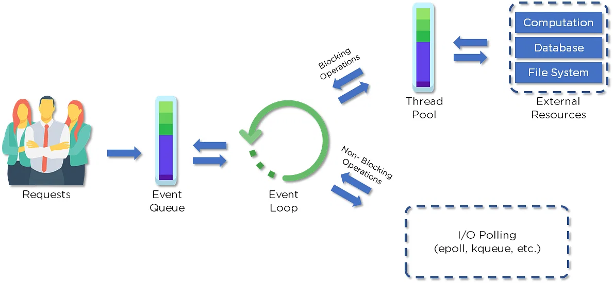

<h1 align="center">👀 NODE JS INTERVIEW QUESTIONS AND ANSWERS 👀 </h1>

## 1. What is Node.js? 
Node.js is an open-source, cross-platform JavaScript runtime environment and library to run web applications outside the client’s browser. It is used to create server-side web applications.

## 2. Why use Node.js?
Node.js makes building scalable network programs easy. Some of its advantages include:

* It is generally fast
* It rarely blocks
* It offers a unified programming language and data type
* Everything is asynchronous 
* It yields great concurrency

## 3. How does Node.js work?
A web server using Node.js typically has a workflow that is quite similar to the diagram illustrated below. Let’s explore this flow of operations in detail.

* Clients send requests to the webserver to interact with the web application. Requests can be non-blocking or blocking:
* Querying for data
* Deleting data 
* Updating the data
* Node.js retrieves the incoming requests and adds those to the Event Queue
* The requests are then passed one-by-one through the Event Loop. It checks if the requests are simple enough not to require any external resources
* The Event Loop processes simple requests (non-blocking operations), such as I/O Polling, and returns the responses to the corresponding clients
## 4. Why is Node.js Single-threaded?
Node.js is single-threaded for async processing. By doing async processing on a single-thread under typical web loads, more performance and scalability can be achieved instead of the typical thread-based implementation.

## 5. If Node.js is single-threaded, then how does it handle concurrency?
The Multi-Threaded Request/Response Stateless Model is not followed by the Node JS Platform, and it adheres to the Single-Threaded Event Loop Model. The Node JS Processing paradigm is heavily influenced by the JavaScript Event-based model and the JavaScript callback system. As a result, Node.js can easily manage more concurrent client requests. The event loop is the processing model's beating heart in Node.js.

## 6. Explain callback in Node.js.
A callback function is called after a given task. It allows other code to be run in the meantime and prevents any blocking.  Being an asynchronous platform, Node.js heavily relies on callback. All APIs of Node are written to support callbacks.

## 7. What are the advantages of using promises instead of callbacks?
* The control flow of asynchronous logic is more specified and structured.
* The coupling is low.
* We've built-in error handling.
* Improved readability.

## 8. How would you define the term I/O? 
* The term I/O is used to describe any program, operation, or device that transfers data to or from a medium and to or from another medium
* Every transfer is an output from one medium and an input into another. The medium can be a physical device, network, or files within a system

## 9. How is Node.js most frequently used?
Node.js is widely used in the following applications:

* Real-time chats
* Internet of Things
* Complex SPAs (Single-Page Applications)
* Real-time collaboration tools
* Streaming applications
* Microservices architecture

## 10. Explain the difference between frontend and backend development?
<table>
  <tr>
    <th>Front End</th>
    <th>Back End</th>
  </tr>
  <tr>
    <td>Frontend refers to the client-side of an application</td>
    <td>Backend refers to the server-side of an application</td>
  </tr>
  <tr>
    <td>It is the part of a web application that users can see and interact with</td>
    <td>It constitutes everything that happens behind the scenes</td>
  </tr>
  <tr>
    <td>It typically includes everything that attributes to the visual aspects of a web application</td>
    <td>It generally includes a web server that communicates with a database to serve requests</td>
  </tr>
  <tr>
    <td>HTML, CSS, JavaScript, AngularJS, and ReactJS are some of the essentials of frontend development</td>
    <td>Java, PHP, Python, and Node.js are some of the backend development technologies</td>
  </tr>
</table>

## 11. What is NPM?
NPM stands for Node Package Manager, responsible for managing all the packages and modules for Node.js.

Node Package Manager provides two main functionalities:

* Provides online repositories for node.js packages/modules, which are searchable on search.nodejs.org
* Provides command-line utility to install Node.js packages and also manages Node.js versions and dependencies

## 12. What are the modules in Node.js?
Modules are like JavaScript libraries that can be used in a Node.js application to include a set of functions. To include a module in a Node.js application, use the require() function with the parentheses containing the module's name.

## 13. Why is Node.js preferred over other backend technologies like Java and PHP?
Some of the reasons why Node.js is preferred include:

* Node.js is very fast
* Node Package Manager has over 50,000 bundles available at the developer’s disposal
* Perfect for data-intensive, real-time web applications, as Node.js never waits for an API to return data
* Better synchronization of code between server and client due to same code base
* Easy for web developers to start using Node.js in their projects as it is a JavaScript library

## 14. What is the difference between Angular and Node.js?
<table>
  <tr>
    <th>Angular</th>
    <th>Node.js</th>
  </tr>
  <tr>
    <td>It is a frontend development framework</td>
    <td>It is a server-side environment</td>
  </tr>
  <tr>
    <td>It is written in TypeScript</td>
    <td>It is written in C, C++ languages</td>
  </tr>
  <tr>
    <td>Used for building single-page, client-side web applications</td>
    <td>Used for building fast and scalable server-side networking applications</td>
  </tr>
  <tr>
    <td>Splits a web application into MVC components</td>
    <td>Generates database queries</td>
  </tr>
</table>

## 15. Which database is more popularly used with Node.js?
MongoDB is the most common database used with Node.js. It is a NoSQL, cross-platform, document-oriented database that provides high performance, high availability, and easy scalability.

## 16. What are some of the most commonly used libraries in Node.js?
There are two commonly used libraries in Node.js:

* ExpressJS - Express is a flexible Node.js web application framework that provides a wide set of features to develop web and mobile applications.
* Mongoose - Mongoose is also a Node.js web application framework that makes it easy to connect an application to a database.

## 17. What are the pros and cons of Node.js?
<table>
  <tr>
    <th>Pros</th>
    <th>Cons</th>
  </tr>
  <tr>
    <td>Fast processing and an event-based model</td>
    <td>Not suitable for heavy computational tasks</td>
  </tr>
  <tr>
    <td>Uses JavaScript, which is well-known amongst developers</td>
    <td>Using callback is complex since you end up with several nested callbacks</td>
  </tr>
  <tr>
    <td>Node Package Manager has over 50,000 packages that provide the functionality to an application</td>
    <td>Dealing with relational databases is not a good option for Node.js</td>
  </tr>
  <tr>
    <td>Best suited for streaming huge amounts of data and I/O intensive operations</td>
    <td>Since Node.js is single-threaded, CPU intensive tasks are not its strong suit</td>
  </tr>
</table>

## 18. What is an Event Loop in Node.js?
Event loops handle asynchronous callbacks in Node.js. It is the foundation of the non-blocking input/output in Node.js, making it one of the most important environmental features.

## 19. What is an EventEmitter in Node.js?
The EventEmitter is a node module that allows objects to communicate with one another, The core of Node's asynchronous event driven architecture is EventEmitter.
* EventEmitter is a class that holds all the objects that can emit events
* Whenever an object from the EventEmitter class throws an event, all attached functions are called upon synchronously

## 20. What are the two types of API functions in Node.js?
The two types of API functions in Node.js are:

* Asynchronous, non-blocking functions
* Synchronous, blocking functions

## 21. What is the package.json file?
This file holds the metadata for a particular project. The package.json file is found in the root directory of any Node application or module

## 22. What is the Express.js package?
Express is a flexible Node.js web application framework that provides a wide set of features to develop both web and mobile applications

## 23. Explain asynchronous and non-blocking APIs in Node.js.
* All Node.js library APIs are asynchronous, which means they are also non-blocking
* A Node.js-based server never waits for an API to return data. Instead, it moves to the next API after calling it, and a notification mechanism from a Node.js event responds to the server for the previous API call

## 24. What is a callback function in Node.js?
A callback is a function called after a given task. This prevents any blocking and enables other code to run in the meantime.

## 25. For Node.js, why does Google use the V8 engine?
The V8 engine, developed by Google, is open-source and written in C++. Google Chrome makes use of this engine. V8, unlike the other engines, is also utilized for the popular Node.js runtime. V8 was initially intended to improve the speed of JavaScript execution within web browsers. Instead of employing an interpreter, V8 converts JavaScript code into more efficient machine code to increase performance. It turns JavaScript code into machine code during execution by utilizing a JIT (Just-In-Time) compiler, as do many current JavaScript engines such as SpiderMonkey or Rhino (Mozilla).

## 26. Explain the concept of middleware in Node.js.
Middleware is a function that receives the request and response objects. Most tasks that the middleware functions perform are:  

* Execute any code
* Update or modify the request and the response objects
* Finish the request-response cycle
* Invoke the next middleware in the stack

## 27. What are the different types of HTTP requests?
HTTP defines a set of request methods used to perform desired actions. The request methods include:

* GET: Used to retrieve the data

* POST: Generally used to make a change in state or reactions on the server

* HEAD: Similar to the GET method, but asks for the response without the response body

* DELETE: Used to delete the predetermined resource

## 28. What is the difference between asynchronous and synchronous functions?
Synchronous functions block the execution of other code until they are complete, while asynchronous functions allow other code to continue executing while they are running, making them essential for writing scalable Node.js applications.

## 29. Can you access DOM in Node?
No, you cannot access the DOM in Node.js. The DOM is a browser-specific API that allows for the manipulation of HTML and XML documents. Since Node.js does not run in a browser, it does not have access to the DOM.

## 30. What is "non-blocking" in node.js?
In Node.js, non-blocking refers to the ability of the runtime environment to execute multiple tasks simultaneously without waiting for the completion of one task before starting the next. This is achieved through the use of asynchronous I/O operations, which allow Node.js to handle multiple requests concurrently. 